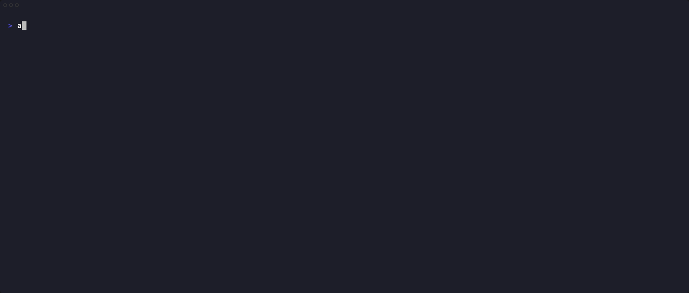
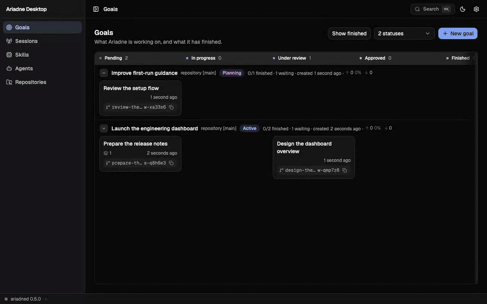

<p align="center">
  
</p>

<p align="center">
  <a href="https://github.com/manuel-alvarez-alvarez/ariadne/actions/workflows/ci.yml"></a>
  <a href="https://github.com/manuel-alvarez-alvarez/ariadne/releases/latest"></a>
  <a href="LICENSE"></a>
  <a href="https://www.rust-lang.org"></a>
</p>

<p align="center">
  <a href="docs/README.md"><b>Manual</b></a>
  &nbsp;·&nbsp;
  <a href="#quick-start"><b>Quick start</b></a>
  &nbsp;·&nbsp;
  <a href="docs/how-it-works.md"><b>How it works</b></a>
  &nbsp;·&nbsp;
  <a href="docs/install.md"><b>Install</b></a>
  &nbsp;·&nbsp;
  <a href="ui/README.md"><b>Desktop app</b></a>
</p>

<h3 align="center">A docker-style orchestrator for AI coding agents.</h3>

<p align="center">
  You describe a goal. A daemon (<code>ariadned</code>) breaks it into tasks with an <b>orchestrator</b> agent,<br>
  hands each task to an <b>author</b> agent that owns it until it lands,<br>
  and gates that landing behind one or more <b>reviewer</b> agents.
</p>

<p align="center">
  Every agent runs as an ACP session, and every task gets its own git worktree. Connect to an
  agent console at any moment to read events, send a prompt, or answer a permission question.
  Built-in registry entries start <b>Claude Code ACP</b>, <b>Codex ACP</b>, and <b>OpenCode
  ACP</b>; you can add any compatible agent. A goal picks each agent's model and effort.
</p>

<p align="center">
  
</p>

<p align="center">
  <sub>One goal, its tasks, and the agents running them — from the terminal.</sub>
</p>

## Features

<table>
<tr>
<td width="50%" valign="top">
<h4>🧩 ACP agents, one interface</h4>
Every agent speaks ACP. Built-in entries run Claude Code ACP, Codex ACP, and OpenCode ACP; add
another command in the registry when it meets the protocol contract. A model is spelled
<code>&lt;agent-id&gt;:&lt;model&gt;</code>, and <code>--effort</code> beside it says how deeply it
reasons.
</td>
<td width="50%" valign="top">
<h4>📝 A plan you agree to</h4>
The orchestrator asks until nothing about the goal is open, then writes the tasks. Nothing runs
until the plan is finalized, and <code>ariadne task update</code> is yours until it does.
</td>
</tr>
<tr>
<td width="50%" valign="top">
<h4>✅ Review gates every landing</h4>
Reviewers read the diff in detached read-only worktrees and approve or request changes. A change
request resumes the author with the feedback.
</td>
<td width="50%" valign="top">
<h4>🚢 Three ways a task can end</h4>
<code>merge</code> squashes onto the base branch, <code>pull_request</code> opens a request and
sees it through the forge, and <code>none</code> lands nothing at all.
</td>
</tr>
<tr>
<td width="50%" valign="top">
<h4>🌱 A worktree and a branch per task</h4>
Tasks run in parallel without touching each other's checkout, and the daemon verifies every merge
before it accepts the sha.
</td>
<td width="50%" valign="top">
<h4>📚 Skills, not personas</h4>
An agent is its skills, its model and its brief — one document per kind of work, from the catalog
Ariadne ships and the ones you write.
</td>
</tr>
<tr>
<td width="50%" valign="top">
<h4>🖥️ Connect whenever you want</h4>
Every session has a console. <code>ariadne attach</code> shows its events and accepts prompts;
<code>ariadne attention</code> says who is waiting for you.
</td>
<td width="50%" valign="top">
<h4>⚡ Nothing polls</h4>
The daemon streams: events, agent consoles and its own log, over a REST API with OpenAPI at
<code>/api-docs/openapi.json</code> and SSE at <code>/v1/events/stream</code>.
</td>
</tr>
</table>

## Ariadne Desktop

The same daemon, in a window: goals, tasks, diffs, agent consoles and the live
event stream. It is a pure REST/SSE client of the daemon's TCP listener — the
same code runs in a browser tab and in the packaged [Tauri
2](https://v2.tauri.app) app — and `scripts/install.sh` installs it beside the
CLI.

<p align="center">
  
</p>

> [!NOTE]
> The daemon's TCP listener is off by default. Set `tcp_listen` in
> `~/.ariadne/config.toml` before the app can reach it — see
> [Configuration](docs/configuration.md).

## Quick start

```sh
scripts/install.sh                     # CLI, daemon service, completions, desktop app
ariadne daemon start                   # unix socket at ~/.ariadne/ariadne.sock

ariadne models ls                      # choose an available <agent-id>:<model-id>

ariadne repo add ~/projects/api --description "the public API"
ariadne goal create --title "Add rate limiting" --repo ~/projects/api \
    --model codex-acp:<model-id>
ariadne goal attach <goal-id>          # answer the orchestrator's questions

ariadne attention                      # what is waiting for you, across every goal
ariadne task ls --goal <goal-id>       # what is going on
```

> [!TIP]
> Every command takes `--help`, and [`ariadne doctor`](docs/cli.md) is what to
> run when something is not working: it reports what your shell sees *and* what
> the daemon sees.

The [manual](docs/README.md) has the rest.

## Overview

```
┌─────────┐   REST (unix socket / TCP)   ┌──────────────────────────────┐
│ ariadne │ ───────────────────────────► │           ariadned           │
│  (CLI)  │                              │  scheduler · ACP · git · db  │
└─────────┘                              └──────┬───────────────────────┘
     ▲                                          │ spawns (ACP agents, worktree per task)
     │ MCP (stdio)                              ▼
     │        ┌──────────────┐   ┌────────┐   ┌──────────┐
     └─────── │ orchestrator │   │ author │   │ reviewer │  · ACP events report progress
              └──────────────┘   └────────┘   └──────────┘  · tools via `ariadne mcp serve`
```

[How Ariadne works](docs/how-it-works.md) follows one goal from the question
the orchestrator asks to the commit on the base branch.

<details>
<summary><b>The top-level tree</b></summary>

```
crates/          the Rust workspace: ariadned, the ariadne CLI and the libraries
                 they share — crate by crate in crates/AGENTS.md
docs/            the manual: install, the CLI, events, configuration
scripts/         install.sh / uninstall.sh + lib.sh, their shared step output
ui/              Ariadne Desktop (Tauri 2 + React): a REST/SSE client of the daemon's
                 TCP listener, outside the cargo workspace — see ui/AGENTS.md and
                 ui/README.md
```

</details>

## Documentation

| Page | What it covers |
| --- | --- |
| [Installing Ariadne](docs/install.md) | the installer, ACP agents, the release assets, the desktop app, and the daemon service |
| [Shell completion](docs/shell-completion.md) | dynamic completions for bash, zsh and fish, and the static fallback |
| [Using the CLI](docs/cli.md) | the command tour, the reference, and how tables and colour are printed |
| [Following what happens](docs/following-events.md) | events, the log streams and the `--watch` tables |
| [Configuration](docs/configuration.md) | every key of `~/.ariadne/config.toml`, and the environment that addresses a daemon |
| [Permission modes](docs/permissions.md) | automatic, prompted, and remembered ACP permission answers |
| [Adopting a session](docs/adopting-sessions.md) | finding an ACP agent's stored session and using it as a task author |
| [How Ariadne works](docs/how-it-works.md) | planning, authoring, review, landing, and ACP sessions |
| [Ariadne Desktop](ui/README.md) | running the desktop app |

## Development

[`AGENTS.md`](AGENTS.md) holds the conventions for changing this repository,
the commit types included — they are written down there and nowhere else — and
points at the file each area keeps: [`crates/AGENTS.md`](crates/AGENTS.md) for
the Rust workspace and its cargo commands,
[`ui/AGENTS.md`](ui/AGENTS.md) for the desktop app. [`specs/`](specs/README.md)
describes what each subsystem does, as it stands. The release loop is in
[`.github/RELEASING.md`](.github/RELEASING.md).

## License

Apache-2.0. See [`LICENSE`](LICENSE).
